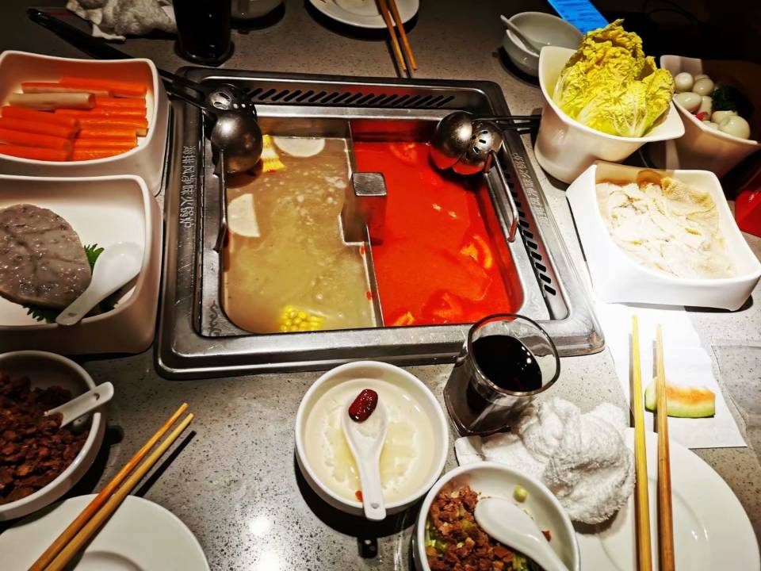

## G03组第1次Team Building记录

> Building时间：2021年03月20日 下午 16:30-18:30
>
> Building地点：中大银泰城海底捞
>
> 出席人员：吕博图、岑盛泽、潘姝焱、邓皓文、庄博伟
>
> 缺席人员：无
>
> 主  持  人：吕博图
>
> 记  录  人：吕博图

#### 一、Team Building背景及目的

团队初创，为了今后更好的合作，举办本次Team Building。

#### 二、Team Building回顾

团队成员在聚餐中主要谈了谈对上学期软工的心得，并说明了各自的长处以及对这门课程的展望。

#### 三、Team Building总结及效果评估

本次Team Building使小组成员互相更加了解，并确定了吕博图作为小组组长及项目经理。

