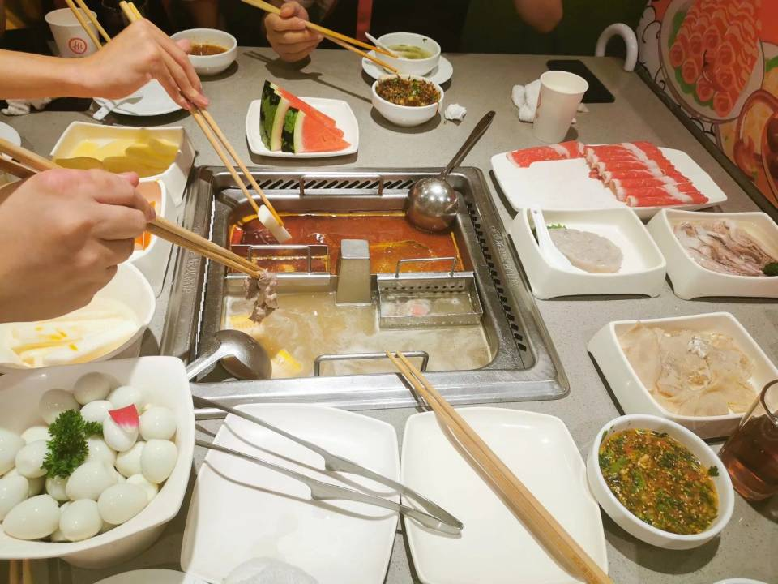

## G03组第2次Team Building记录

> Building时间：2021年06月01日 下午 16:30-18:30
>
> Building地点：中大银泰城海底捞
>
> 出席人员：吕博图、岑盛泽、潘姝焱、邓皓文、庄博伟
>
> 缺席人员：无
>
> 主  持  人：吕博图
>
> 记  录  人：吕博图

#### 一、Team Building背景及目的

SRS成功通过评审，回顾300多页的文档，每一页都来之不易。而参加算法竞赛的几个成员也接近了赛季尾声，能抽出一定的时间。为了庆祝项目阶段性胜利，组长决定组织本次Team Building。

#### 二、Team Building回顾

本次Team Building由于成员们身心疲惫，大家都集中精力在吃上面。尤其是皓文同学分享了他的独家海底捞吃得爽秘籍，我们开玩笑说如果杨老师什么时候有自助餐空位带上皓文同学，肯定能血赚。

#### 三、Team Building总结及效果评估

本次Team Building沟通较为不到位，主要是组长没有打开话匣子，对团队的作用可能没有那么明显，好在大家都吃饱了，有力气继续干活了。
