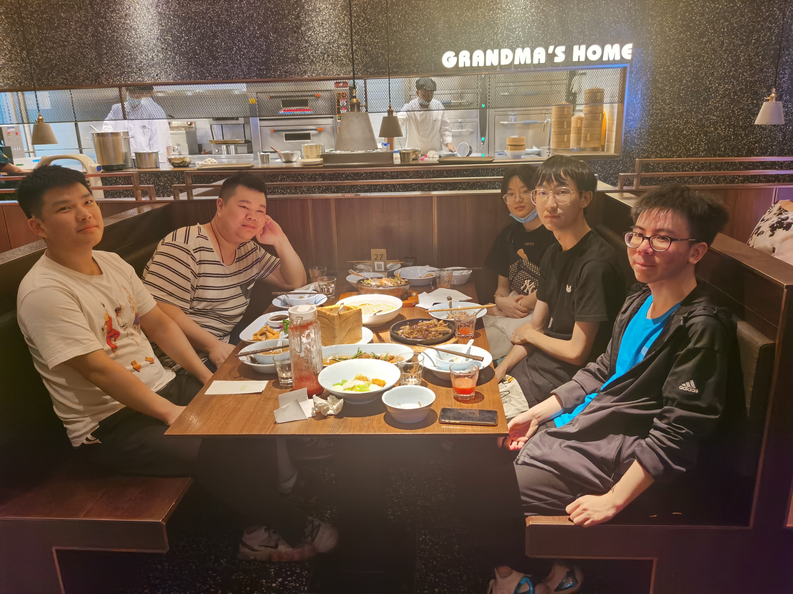

## G03组第3次Team Building记录

> Building时间：2021年06月23日 下午 17:30-18:30
>
> Building地点：中大银泰城外婆家
>
> 出席人员：吕博图、岑盛泽、潘姝焱、邓皓文、庄博伟
>
> 缺席人员：无
>
> 主  持  人：吕博图
>
> 记  录  人：吕博图

#### 一、Team Building背景及目的

临近项目收尾，杨老师提及“多半的人都倒在了最后10%的过程中”。为增强团队凝聚力，以更好的状态准备项目收尾阶段，岑盛泽同学提议开展本次Team Building，由组长组织组员在中大银泰城外婆家聚餐。

#### 二、Team Building回顾

参与人员合影

聚餐过程中，我们主要围绕本学期的学习生活展开话题，可以说是一个“吐槽大会”。

组内的实验室成员主要分享了参加竞赛的一些趣闻，比如西北工业大学有多么郊区，皓文同学为什么拒绝坐飞机等。岑盛泽和潘姝焱同学也分享了生活中的一些经历。同时，我们还分享了对之后大四的一些展望。

笑谈间，岑盛泽吐露了后悔让我当组长的心声，而我也认识到自己作为组长确实不够负责任，并向组员们道歉，大家也都释怀了。

最终，在组长起头下，大家都表示最后收尾阶段全力以赴，尽量交一份让所有人满意的答卷。

#### 三、Team Building总结及效果评估

本次Team Building承上启下，让小组从之前评审的打击中恢复信心，重整旗鼓，加强了团队的凝聚力。可以预见，本次Team Building将对项目收尾阶段的工作起到很好的促进作用。
