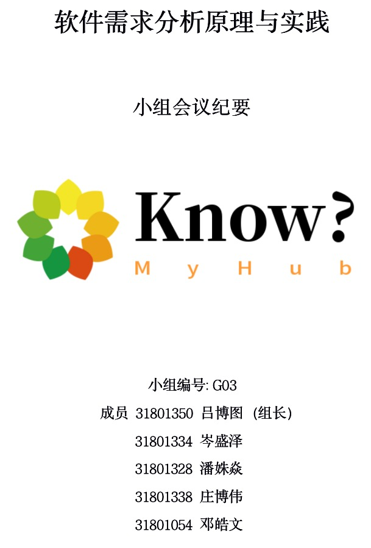

# G03-知否-云端知识库

## 第12次会议记录-JAD会议会议记录

| 会议主题   | 界面原型的确认与JAD会议 |
| :-------  | ---------------------------- |
| 时间      | 2021-05-19 22:04~22:40 |
| 地点      | 线上会议               |
| 主持人    | 岑盛泽                 |
| 记录人    | 潘姝焱                    |
| 参与人员  | 吕博图，陈幼安(企业助教)，岑盛泽，庄博伟，邓皓文，潘姝焱，李以昕（用户），陈正祎（管理员用户），苗皓淇（开发者代表） |
| 会议内容  | 如下                         |

# 会议内容

1. 界面原型确认

   小组项目界面原型与助教的确认

   小组界面原型问题的提出与分析建议

2. JAD会议

​     开发者代表、用户、管理员用户与小组成员基于现阶段界面原型，集体讨论可能满足客户需求的方案。

# 会议总结

经过与助教的会议讨论，认为界面原型存在以下问题：

1. QA库界面过于简陋
2. 评论功能需要进一步完善
3. 用户端的界面没有与管理员端界面分开
4. 移动端功能缺失（没有登录等功能）
5. 移动端部分界面设计不合理，没有底部tab栏

经过与助教的讨论分析，我们最终得出以下结论：

1. 更新QA库界面，将此作为需求变更阶段的任务
2. 分析“一键生成思维导图”功能的可行性
3. 完善修改PC端界面
4. PC端管理员界面与用户界面进一步独立
5. 完善修改移动端界面
6. 在界面中多增加一些亮点

经过与各用户代表召开JAD会议，我们主要得出以下结论及作出以下建议：

1. QA库界面不符合用户使用习惯，字体等比例存在问题
2. 管理员需要做一个提示功能
3. 举报知识库的功能界面有待进一步完善
4. 用户需要增加提示功能
5. 思维导图功能下载按钮设计不符合用户习惯，需要另加一个下载按钮

# 下一阶段任务

1. 分析思维导图功能的技术可行性
2. 独立管理员与用户界面
3. 修改QA库界面，将此作为需求变更阶段的任务
4. 在管理员端添加提示功能
5. 在用户端添加提示消息功能
6. 举报知识库功能界面进一步完善
7. 移动端部分页面修改（无底部tab栏）
8. 移动端功能界面补齐（登录等）
9. 修改生成思维导图功能方式
10. 适当增加功能亮点

